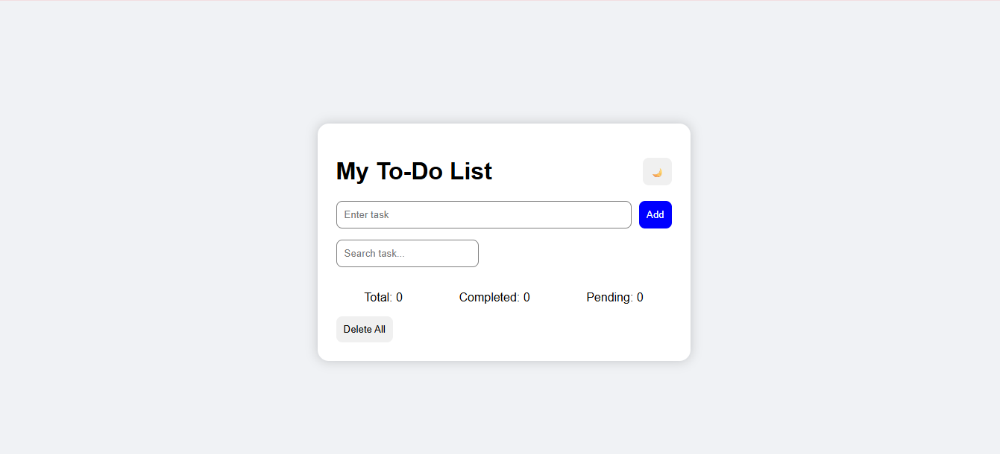
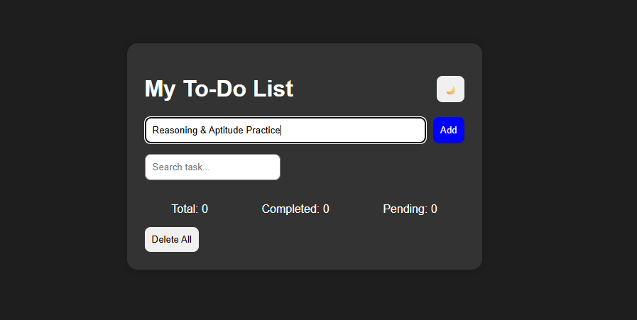
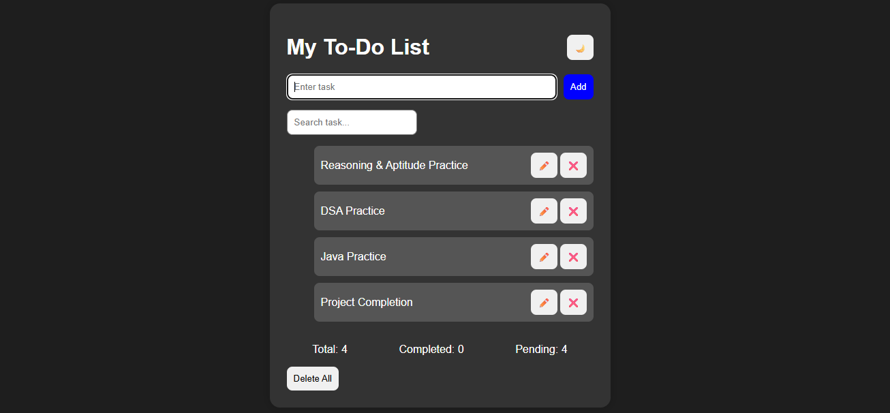
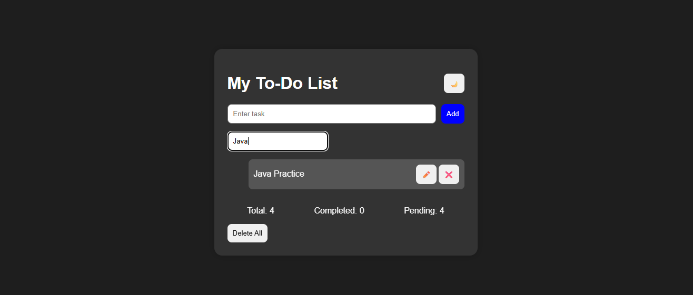
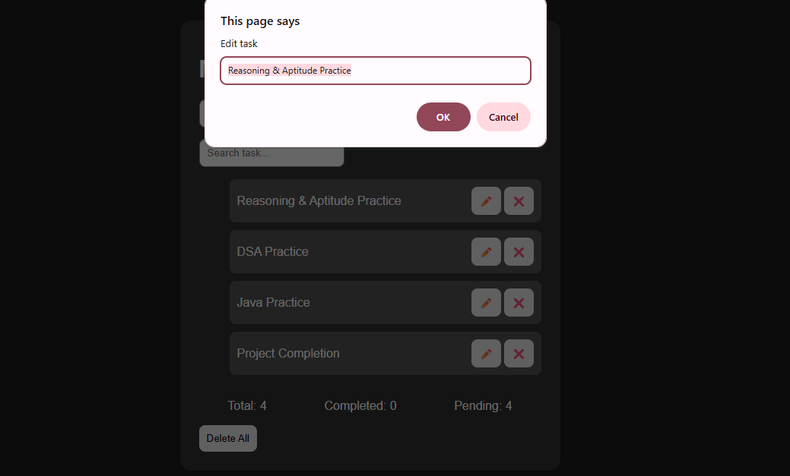
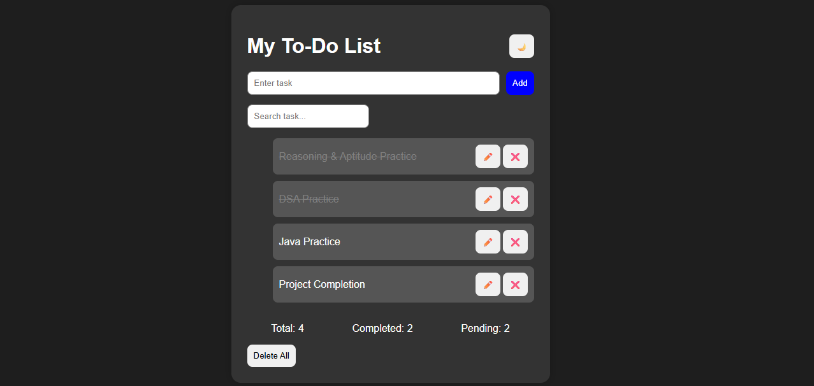
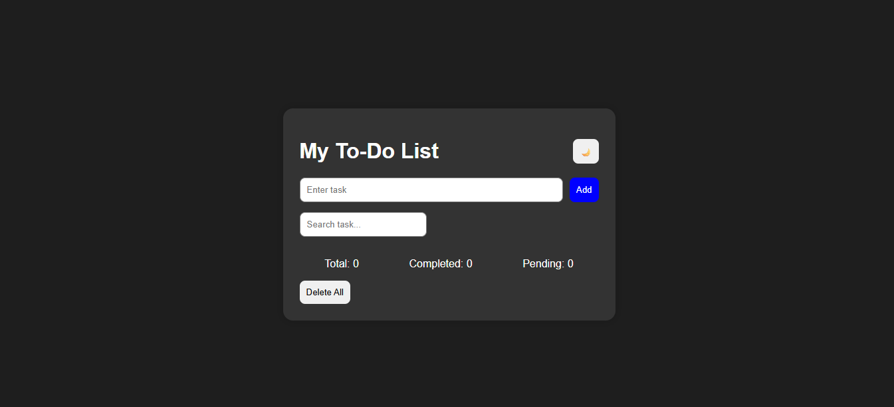
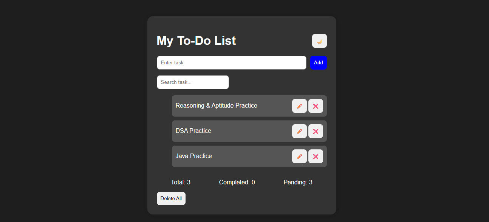
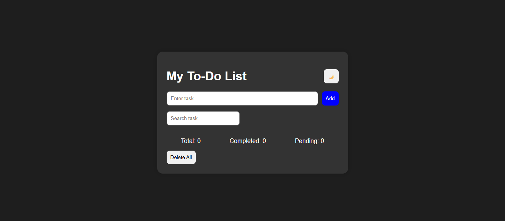

# Advanced To-Do App

A responsive and interactive To-Do application built using HTML, CSS, and JavaScript.

## Features

- Add new tasks
- Delete single task
- Delete all tasks
- Edit tasks
- Mark tasks as completed
- Search tasks
- Dark mode toggle
- Task statistics
- Local storage support

## Technologies Used

- HTML5
- CSS3
- JavaScript

## Screenshots

### Main Page

### Add Task

### Task List

### Search Task

### Edit Task

### Completed Tasks

### Dark Mode

### Delete Single Task

### Delete All Tasks

## Future Improvements

- Add due dates
- Drag and drop tasks
- Categories
- Notifications

## Author

Malla Saranya
